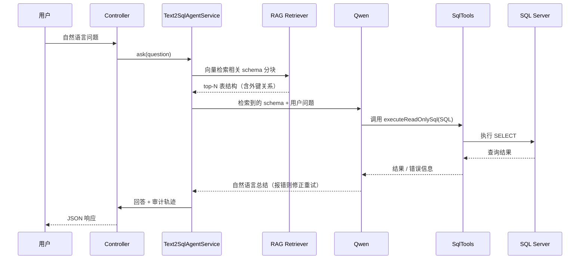

# Text2SQL Agent（自然语言转 SQL 智能体）

基于 **Spring Boot 4.1 + LangChain4j 1.20 + Qwen（DashScope）+ SQL Server** 的 Text-to-SQL Agent。用户用自然语言提问业务数据库，Agent 自动完成：**RAG 检索表结构 → 生成 T-SQL → 安全校验 → 只读执行 → 自然语言回答**，全程可审计。

示例业务库：经典 **Northwind**（Employees / Customers / Orders / Products / `[Order Details]` 等 13 张表，含自引用外键 `Employees.ReportsTo`）。

---

## 1. 项目目标

1. **自然语言查库**：让非技术用户用自然语言查询 SQL Server 业务库，无需手写 SQL。
2. **多表关联**：自动发现相关表、利用外键关系生成正确的 JOIN（含自连接场景）。
3. **百表级可扩展**：面向成百上千张表的业务库，通过 RAG 只召回相关表结构，不把全部 schema 塞进 Prompt。
4. **安全第一**：只允许 SELECT，禁止 DDL/DML；生产环境使用只读数据库账号。
5. **全链路可审计**：记录用户问题、检索到的 schema、生成的 SQL、执行结果，便于排查幻觉与合规审计。
6. **Schema 可同步**：一次性元数据入库任务；业务库 Schema 变化后重跑即可刷新向量库，代码零硬编码表名/字段名。

---

## 2. 技术栈

| 层 | 选型 | 说明 |
|---|---|---|
| 语言 | Java 21+（兼容 Java 26） | Spring Boot 4.1 基线 |
| 构建 | Gradle（8.14+ / 9.x） | 与 Spring Boot 4.1 匹配 |
| Web | `spring-boot-starter-webmvc` | 简单 REST 接口（勿与 webflux 混用） |
| AI 框架 | LangChain4j `1.20.0-beta30` | Java 原生 LLM / Agent / RAG 框架 |
| 模型接入 | `langchain4j-community-dashscope-spring-boot-starter` | Qwen 原生集成，自动装配 ChatModel / EmbeddingModel Bean |
| 对话模型 | Qwen（`qwen-max`） | 生成 T-SQL 与自然语言总结 |
| 向量化 | Qwen `text-embedding-v3` | 中文/混合语义检索，优于本地 ONNX 小模型 |
| 向量存储 | `InMemoryEmbeddingStore`（演示）/ PGVector（生产） | 演示版重启后需重新 ingest |
| 数据库 | SQL Server（Northwind） | `mssql-jdbc` |
| SQL 校验 | 关键字黑名单 +（可升级）JSqlParser | 结构级校验的演进路径 |
| 其他 | Lombok 1.18.48 | 已确认 JDK 26 兼容 |

---

## 3. 架构设计

整个系统分为**两个模块**：

1. **Schema 同步模块**（一次性 / 按需任务）：读取 SQL Server 系统元数据，构建分块文本，向量化后写入向量库。
2. **运行时 Text2SQL Agent**（RAG + 工具调用）：检索相关表结构 → Qwen 生成 T-SQL → 工具执行 → 总结回答。

### 核心组件

| 组件 | 职责 |
|---|---|
| `SchemaIngestionService` | 读取元数据 → 构建分块 → 向量化入库（`POST /api/ingest-schema` 触发） |
| `RagSchemaRetrieverService` | LangChain4j 原生 RAG，检索 top-N 相关 schema 分块 |
| `SqlTools` | `@Tool` 工具：只读执行 T-SQL（SELECT 白名单 + 危险关键字黑名单） |
| `Text2SqlAgentService` | 编排 Agent：注入检索到的 schema、组装 Prompt、工具调用上限防护 |
| `AgentAuditLog` | 全步骤审计（用户问题 / RAG 结果 / SQL / 工具输入输出 / 最终回答） |
| `Text2SqlController` | REST 入口 |

---

## 4. 主要流程

### 4.1 Schema 同步（一次性任务）

1. 读取 `INFORMATION_SCHEMA.TABLES` 获取全部业务表。
2. 逐表读取列（名称/类型/可空）、主键、外键（含自引用，如 `Employees.ReportsTo → Employees.EmployeeId`）。
3. 组装分块文本：**表名 + 主键 + 全列 + 外键关系**；表名含空格时附加「请使用 `[Order Details]` 方括号语法」提示。
4. 用 `text-embedding-v3` 向量化后写入向量库。
5. 业务库 Schema 变更 → 再次调用 `/api/ingest-schema` 全量刷新（生产可演进为增量同步）。

### 4.2 运行时查询



---

## 5. 使用方法

### 5.1 前置条件

- SQL Server 中已创建 **Northwind** 数据库（13 张表及外键）。
- **DashScope（阿里云百炼）API Key**：`https://bailian.console.aliyun.com/` 
- JDK 21+、Gradle 8.14+。

### 5.3 构建与启动

```bash
./gradlew clean build
./gradlew bootRun
```

### 5.4 接口

| 接口 | 说明 |
|---|---|
| `GET /sync` | 一次性把 Northwind 全部表结构同步进向量库 |
| `GET /chat` | 传入自然语言问题，返回回答 + 完整审计记录 |

调用示例：

```bash
curl -X GET http://localhost:8080/sync

curl -X GET http://localhost:8080/chat?message="Show total order amount grouped by customer region"\
  -H "Content-Type: text/plain" \
```

### 5.5 示例问题（Demo 测试用例）

| 场景 | 提问 | 考察点 |
|---|---|---|
| 多表 JOIN + 聚合 | Show total order amount grouped by customer region | 外键驱动 JOIN |
| 自连接 | Find all employees and their manager name | `Employees.ReportsTo` 自引用 |
| 方括号表名 | Which products were ordered most | `[Order Details]` 含空格表名 |
| 多表 + 聚合 | List each customer company and their total freight | 3 表关联 |

---

## 6. 设计考虑点（Trade-offs）

1. **RAG 而非全量 Schema 入 Prompt**
   百表场景下全量 DDL 会撑爆上下文窗口、稀释注意力、加剧幻觉。RAG 按语义只召回 top-N 相关表分块，兼顾准确率与成本。

2. **DashScope 原生模块而非 OpenAI 兼容模式**
   原生集成支持 Qwen 原生工具调用（Agent 关键能力）、`text-embedding-v3` 中文语义检索，且**无需本地 ONNX 模型**（规避 DJL 原生库加载失败、离线环境不可用的问题）。

3. **Schema 分块设计**
   每个分块 = 表 + 主键 + 全列 + 外键，保证一次检索返回完整上下文；含空格表名附加方括号提醒，直接针对 Northwind `[Order Details]` 类陷阱。

4. **外键元数据支撑多表 JOIN**
   从 `sys.foreign_keys` 显式提取关系并注入 Prompt，Qwen 不再“猜”表间关联，自引用外键同样覆盖。

5. **安全控制**
   工具层强制 SELECT 白名单 + DDL/DML 关键字黑名单；生产建议：只读数据库账号、查询超时与行数上限、审计日志。可升级为 JSqlParser 解析 AST 做表/字段存在性校验。

6. **错误重试与工具调用上限**
   SQL 报错信息回传 Qwen 自动修正重试；同时用最大工具调用次数防护，避免 Agent 死循环。

7. **审计日志**
   记录用户问题、RAG 检索结果、生成 SQL、工具输入输出、最终回答，是排查幻觉、合规审计、沉淀微调数据集的依据。

8. **内存向量库 vs 持久向量库**
   演示用 `InMemoryEmbeddingStore`，重启即失、需重新 ingest；生产替换为 PGVector / Milvus / Chroma，并把 ingest 做成独立批处理任务。

9. **minScore 调参**
   `text-embedding-v3` 的相似度分数尺度与本地 ONNX 模型不同，需从较低阈值（如 0.3）开始调，或直接依赖 `maxResults` 截断。

10. **局限与演进方向**
    - 检索后接入 Qwen rerank（`gte-rerank`）提升召回相关性；
    - Schema 增量同步（DDL 触发）替代全量重灌；
    - Prompt 中注入 few-shot 样例提升复杂 JOIN 的 T-SQL 准确率；
    - 查询成本预估（行数/超时）防止重 SQL 拖垮数据库；
    - 审计日志持久化到数据库/ELK。

---
